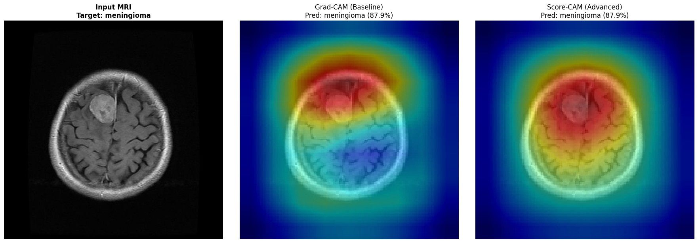
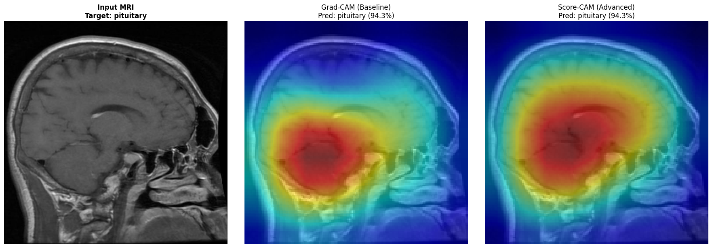
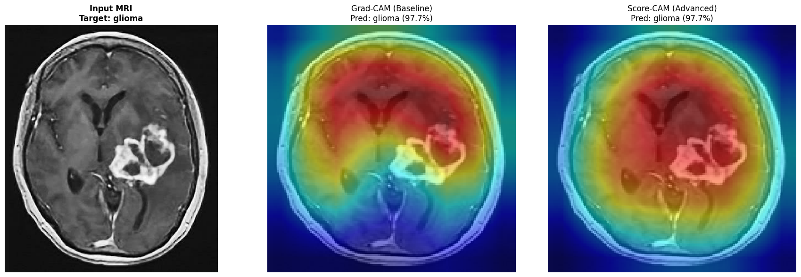
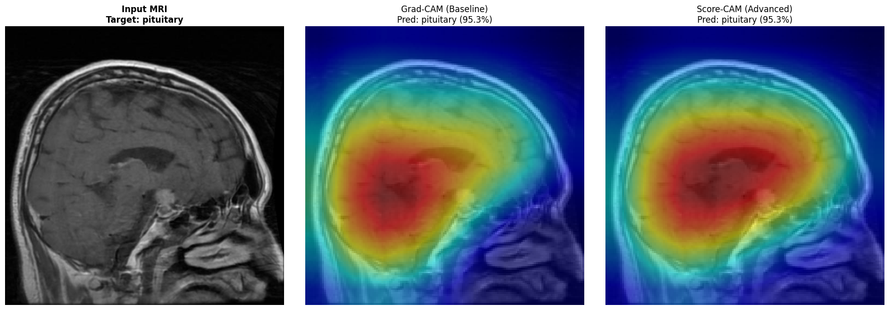
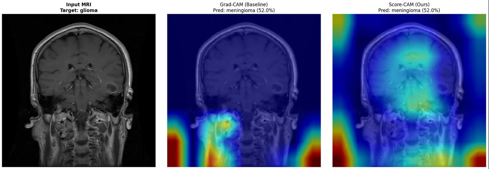
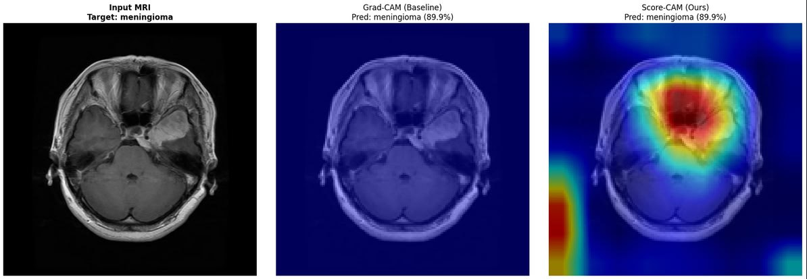

# GliomaLens
## Multiclass Brain Tumor MRI Classification with Attention-Augmented VGG16: Grad-CAM excelled by Score-CAM

**Team:** Lana Ermolaeva | Stepan Vagin | Ramil Shakirzyanov

**Group:** B23-AI-02

**Course:** Explainable, Interpretable, and Fair AI in Innopolis University

**Primary Instructor:** Rustam Lukmanov

**Date:** April 22, 2026

---

## 1. Domain of Application

**Healthcare Diagnostics: Multiclass Brain Tumor Detection from MRI**

Brain tumors are classified from MRI scans into four categories:

| Class | Description |
|---|---|
| Glioma | Aggressive tumor arising from glial cells |
| Meningioma | Tumor growing from the meninges (brain lining) |
| Pituitary | Tumor in the pituitary gland |
| No Tumor | Healthy brain scan |

Dataset: **Kaggle Brain Tumor MRI Dataset** (Masoud Nickparvar) 7,023 labeled MRI scans.

---

## 2. Motivation

Brain tumor diagnosis from MRI is a high-stakes, time-critical task. Radiologists worldwide face increasing workloads, and misdiagnosis carries severe consequences for patients. Deep learning models can match or exceed human-level performance in classification accuracy, but in clinical practice, a prediction without a justification is not trusted.

Clinicians need to know: *"What in this scan made the model say glioma?"*

Without this, even a 99%-accurate model should not be deployed.

(It is even illegal under EU AI Act)

---

## 3. The Real-World Problem

Black-box AI models must not make life-or-death medical decisions without any interpretable justification. A tumor classification system that cannot show *where* it is looking:

- Cannot be audited for bias (e.g., responding to skull shape instead of the tumor)
- Cannot be trusted by clinicians who are legally responsible for diagnosis
- Gives no feedback to identify systematic failure modes
- May be confidently wrong 

---

## 4. The Technical Problem — Inside the Black Box

A deep convolutional neural network (DCNN) like VGG16 transforms a 150×150 MRI image through 13 convolutional layers, producing a 512×9×9 feature tensor before classification. Each of the 512 channels learns a different visual pattern. The final class score is a nonlinear function of millions of parameters.

The black box problem: Given only the input image and the output class, there is no direct way to know which pixels drove the decision. The internal activations encode information in a distributed, high-dimensional space that is not human-interpretable.

XAI methods like Grad-CAM and Score-CAM project this internal representation back onto the image as a heatmap, which is a saliency map showing which regions were most important for the predicted class.

---

## 5. ML Model 

### Architecture: VGG16 + SoftMax Channel Attention

We use a VGG16 backbone extended with a custom channel-level attention head, implemented from scratch based on Aiya et al. [1].

$$
\begin{aligned}
&\text{Input MRI: } (150 \times 150 \times 3) \\
&\Big\downarrow \\
&\text{VGG16 feature extractor (13 conv layers, 5 blocks)} \\
&\Big\downarrow \\
&\text{Feature map } z \in \mathbb{R}^{B \times 512 \times 9 \times 9} \\
&\Big\downarrow \\
&\text{Global average pooling} \;\Rightarrow\; v \in \mathbb{R}^{512} \\
&\Big\downarrow \\
&\text{SoftMax channel attention} \;\Rightarrow\; v_{\text{att}} \in \mathbb{R}^{512} \\
&\Big\downarrow \\
&\text{Linear } (512 \to 4) \;\Rightarrow\; \text{logits} \\
&\Big\downarrow \\
&\text{Predicted class (Glioma / Meningioma / No Tumor / Pituitary)}
\end{aligned}
$$

**Transfer learning strategy:** Convolutional blocks 1–3 (layers 0–19) are frozen, they retain ImageNet low-level feature detectors (edges, textures) which transfer well to MRI. Blocks 4–5 (layers 20+) are fine-tuned on the MRI data.

### Attention Mechanism (from paper)

Given feature map $z \in \mathbb{R}^{B \times C \times H \times W}$:

**Step 1: Global Average Pooling per channel:**
$$v_i = \frac{1}{HW} \sum_{j,k} z_{b,i,j,k}$$

**Step 2: SoftMax attention weights** (learned parameter $w \in \mathbb{R}^C$):
$$\alpha_i = \frac{e^{w_i}}{\sum_{j=1}^{C} e^{w_j}}$$

**Step 3: Weighted feature vector:**
$$v_{\text{att}} = v \odot \alpha$$

**Step 4: Classification:**
$$\text{logits} = W \cdot v_{\text{att}} + b$$

The attention weights $\alpha$ are shared across all inputs in a batch, they are learned channel importance weights, not input-dependent. This is exactly the formulation from Aiya et al. [1].

### Training Configuration

| Hyperparameter | Value |
|---|---|
| Image size | 150 × 150 |
| Optimizer | Adam |
| Learning rate | 1 × 10⁻⁴ |
| Epochs | 10 |
| Batch size | 32 |
| Loss | Cross-Entropy |
| Augmentation | Rotation ±40°, translation ±20%, scale 0.8–1.2×, horizontal flip |

---

## 6. Grad-CAM — The Baseline XAI Method

Gradient-weighted Class Activation Mapping (Grad-CAM) [3] uses gradients of the target class score flowing back to the last convolutional layer to produce a coarse saliency map.

### How It Works

**Step 1 — Compute gradient of target class score $y^c$ w.r.t. feature map $A^{k}$:**
$$\frac{\partial y^c}{\partial A^{k}_{ij}}$$

**Step 2 — Global average pool the gradients to get channel importance weights:**
$$\alpha^c_k = \frac{1}{Z} \sum_i \sum_j \frac{\partial y^c}{\partial A^{k}_{ij}}$$

**Step 3 — Weighted combination of feature maps, followed by ReLU:**
$$L^c_{\text{Grad-CAM}} = \text{ReLU}\!\left(\sum_k \alpha^c_k \cdot A^{k}\right)$$

The ReLU retains only activations that positively influence the class score. The resulting 9×9 map is upsampled to 150×150 and overlaid on the image.

**Implementation:** Applied to `features[28]`, the last ReLU activation in the VGG16 feature extractor.

---

## 7. Grad-CAM Limitations (Motivation for Score-CAM)

Grad-CAM was the natural first choice: it is fast, widely validated, and requires no architectural modification. However, empirical testing on the model surfaced four distinct failure modes that collectively motivated building a custom Score-CAM implementation.

### 1. Vanishing or near-zero saliency despite high confidence
Grad-CAM attributes importance by backpropagating the target class score to the last convolutional layer. In our architecture, that signal must traverse global average pooling, a learned softmax channel-attention reweighting, and a linear classification head before reaching the spatial feature maps. The effective per-channel gradient is proportional to $\alpha_k W_{c,k}$, where $\alpha_k$ is the softmax attention weight for channel $k$ and $W_{c,k}$ is the corresponding classifier weight. Because softmax over 512 dimensions forces most $\alpha_k$ toward near-zero, many channel gradients are suppressed before they reach the convolutional layer. We observed this as a recurring artifact: on some test samples the Grad-CAM map was nearly flat despite the model predicting the correct class with high confidence. A saliency map that is blank when the model is confident provides no actionable signal for clinical review or debugging.

### 2. Misleading “reasonable” maps on high-confidence errors
A second failure mode is qualitative rather than a matter of signal magnitude. Our baseline produced glioma→meningioma at 99.67% confidence and pituitary→meningioma at 98.09% confidence. In both cases, Grad-CAM highlighted a visually plausible brain region, giving no indication that the prediction was wrong. This is the more dangerous failure: a clinician presented with a confident prediction and a coherent-looking heatmap has no reason to distrust the system. Local gradient magnitude reflects sensitivity of the logit with respect to the last convolutional activations, which can appear anatomically reasonable even when the model has latched onto the wrong discriminative feature.

### 3. Spatial cancellation through global gradient averaging
Per-channel importance is obtained by global average pooling of gradients over the spatial dimensions. This collapses opposing gradients within the same channel: positive evidence in one subregion and negative evidence in another cancel, producing an importance weight that reflects neither faithfully. The resulting heatmap may be an aggregate of mixed, spatially inconsistent cues rather than a clean tumor localization.

### 4. Gradients measure local sensitivity, not causal contribution
Grad-CAM answers: *"How much would the logit change if the last feature map changed slightly?"* It does not answer: *"Which spatial regions, when revealed to the model through their channel activations, most increase its confidence in the predicted class?"* For a clinical deployment, the second question is directly relevant. Score-CAM answers it exactly: each channel’s activation map becomes a soft revealing mask ($x \odot M^{k}$), a full forward pass is executed, and the resulting confidence increase above a black-image baseline determines that channel’s importance weight.

---

## 8. Score-CAM — Architecture and Formulas

Score-CAM [2] is a gradient-free method. Instead of using gradients as proxy for importance, it directly measures how much each channel's activation mask increases the model's confidence for the target class.

### Algorithm

**Step 1: Extract activation maps from the target layer:**
$$A^{k} \in \mathbb{R}^{H_f \times W_f}, \quad k = 1, \ldots, C$$

**Step 2: Upsample and normalize each map to [0, 1] to create masks:**
$$M^{k} = \frac{A^{k} - \min(A^{k})}{\max(A^{k}) - \min(A^{k}) + \epsilon}$$

**Step 3: Mask the input image with each channel's normalized map:**
$$x_k = x_{\text{raw}} \odot M^{k}_{\uparrow}$$
where $M^{k}_{\uparrow}$ is bilinearly upsampled to input resolution (150×150).

**Step 4: Score each channel by how much its mask increases target class confidence above a black-image baseline:**
$$s^c_k = f^c(x_k) - f^c(x_{\text{baseline}})$$

**Step 5: Clamp and weighted sum:**
$$L^c_{\text{Score-CAM}} = \sum_k \max(s^c_k, 0) \cdot M^{k}_{\uparrow}$$

---

## 9. What We Changed in Score-CAM

Our implementation differs from the original paper in three key ways, each motivated by empirical observation during development.

### 9.1 Per-Channel Clamping Before Summation
**Original paper:** applies ReLU *after* the weighted sum $\text{ReLU}(\sum_k s^c_k \cdot M^{k})$.  
**Our version:** clamps each score to zero *before* summation: `scores = torch.clamp(scores, min=0.0)`.

**Why:** Channels with negative scores (i.e., their mask reduces confidence below baseline) drag the entire weighted sum downward. When this sum is then passed through ReLU, large negative contributions can blank out the map entirely. Clamping per-channel prevents this: channels that hurt confidence contribute nothing, while positive channels are unaffected.

### 9.2 Full-Resolution Upsampling Before Weighting
**Original paper:** weights the 9×9 feature maps first, then upsample the final sum.  
**Our version:** upsamples all 512 masks to 150×150 first, then weights and sums.

**Why:** Weighting low-resolution maps and upsampling at the end collapses fine spatial structure before it can be preserved. Upsampling first retains channel-level spatial detail in the final heatmap.

### 9.4 Batched Scoring Engine
Running 512 forward passes one-by-one is slow. We batch channels in groups of 32 for efficient GPU utilization, processing the entire 512-channel set in 16 forward passes.

---

## 10. Results

### Classification Metrics (VGG16 + Attention, Test Set of 703 images)

| Class | F1-Score |
|---|---|
| Glioma | 0.854 |
| Meningioma | 0.852 |
| No Tumor | 0.909 |
| Pituitary | 0.936 |
| **Macro Average** | **0.888** |
| **Macro AUC-ROC** | **0.975** |

### Score-CAM vs. Grad-CAM — Qualitative Properties

| Property | Grad-CAM | Score-CAM |
|---|---|---|
| Gradient-free | No | Yes |
| Localization sharpness | Coarse / diffuse | Tighter, tumor-focused |
| Stability / consistency | Unstable; some samples blank; head-dependent | Deterministic forward scores |
| High-confidence error behavior | Misleading or near-zero saliency; cannot self-audit | Confidence-grounded; faithfully reflects forward-pass logic |
| Computation | Single backward pass | 16 batched forward passes |

Score-CAM consistently produces heatmaps that concentrate on the tumor mass rather than surrounding tissue, reducing the risk of a saliency map that looks plausible but points to the wrong region.

---

### Score-CAM vs. Grad-CAM — Quantitative Evaluation

With a robust final model in place, we ran a systematic metric suite comparing both XAI methods across three axes: explanation shape (sparsity), ard-mask fidelity (binary ablation), and soft-mask fidelity (weighted ablation). All evaluations were run on held-out test images.

#### 10.1 Sparsity / Concentration

Sparsity measures how focused an explanation is. A high Gini coefficient means a small fraction of pixels carries most of the attribution weight.

| Metric | Grad-CAM | Score-CAM |
|---|---|---|
| Gini coefficient (↑ = more concentrated) | 0.4009 | 0.3871 |
| Top-10% pixel value ratio (↑ = more concentrated) | 0.2417 | 0.2362 |

**Interpretation:** Grad-CAM is the more concentrated method: it acts as a sharp pointer to a localized discriminative trigger (e.g., a specific edge or texture patch on the tumor boundary). Score-CAM is slightly more distributed, spreading attribution over the broader pathological region.

#### 10.2 Hard-Mask Average Drop (Binary Ablation)

Hard-masking evaluates what happens when the background is completely deleted: pixels below the threshold are zeroed out. A lower Average Drop score is better, it means the model retains more confidence when only the explanation region survives.

| Threshold | Grad-CAM | Score-CAM | 
|---|---|---|
| 0.40 — Aggressive (keep top 60% of pixels) | 0.1725 | 0.2696 | 
| 0.50 — Moderate | 0.1176 | 0.1660 |
| 0.70 — Inclusive (keep top 30% of pixels) | 0.0690 | 0.0678 | 

The trend is consistent: as the threshold becomes more inclusive and more spatial context is preserved in the mask, Score-CAM's performance steadily closes the gap with Grad-CAM and eventually surpasses it.

#### 10.3 Soft-Mask Average Drop (Weighted Ablation)

Soft-masking is the evaluation protocol defined in the original Score-CAM paper: dims the background proportionally to the heatmap value rather than deleting it entirely. This preserves global spatial structure while still weighting important regions.

| Method | Soft-Mask Average Drop (↓ is better) |
|---|---|
| Grad-CAM | 0.1171 |
| Score-CAM | 0.0944 |

Score-CAM decisively outperforms Grad-CAM under this protocol, achieving a 19.4% lower confidence drop (0.0944 vs. 0.1171) when its heatmap is used as the soft mask. The strongest single piece of evidence for its superior global fidelity.

---

### Core Theoretical Findings — The Anatomical Context Dependency

The pattern across all three metric axes is mathematically consistent and points to a single underlying cause: the Anatomical Context Dependency of brain tumor recognition.

**Theory 1 — Local Sensitivity vs. Global Fidelity**

Grad-CAM is a measure of local sensitivity: its gradients act as a precise pointer to the model's most discriminative pixel cluster — the exact edge or texture patch that most rapidly changes the logit. Because this explanation is narrow, it fits comfortably inside an aggressive binary mask (threshold 0.40–0.50), and the model's confidence remains relatively intact. Grad-CAM therefore appears to "win" under hard-masking — but this is an artifact of concentration, not evidence of faithfulness.

Score-CAM is a measure of global fidelity: because it re-scores each channel by the forward-pass confidence increase it produces, it captures the full supportive region — the tumor mass as a coherent spatial object — rather than a single discriminative hotspot. This broader footprint is more representative of how the model actually integrates information across the image, as confirmed by its decisive advantage under soft-masking (0.0944 vs. 0.1171 Average Drop).

**Theory 2 — Brain Tumors Require Anatomical Context**

Unlike recognizing a free-standing object such as a cat, whose class signal is largely self-contained within the object boundary, brain tumor classification is inherently relational. The model must perceive the tumor's size, position, and shape relative to the skull, ventricles, and midline shift. These geometric relationships are clinically decisive: a lesion that appears benign in isolation may indicate an aggressive malignancy given its anatomical surroundings.

When a strict 40–50% binary mask is applied to Score-CAM’s broad attribution map, it performs what we term digital surgery: the tumor region survives, but the surrounding brain geometry is excised. Because the model depends on this anatomical context, its confidence drops sharply — not because Score-CAM’s explanation is wrong, but because it is right. The mask is removing exactly the spatial references the model needs.

Grad-CAM’s narrower pointer survives the same surgery unscathed, which superficially looks like a better explanation. But under soft-masking, where the surrounding brain structure is dimmed but not deleted, Score-CAM’s anatomically complete representation proves decisively superior. The 19.4% advantage in soft-mask Average Drop (0.0944 vs. 0.1171) is the quantitative signature of a method that has faithfully captured the model’s true decision logic.

---

## 11. Example Showcase

The panels below are **3-column comparisons** (original MRI, Grad-CAM, Score-CAM) from the evaluation pipeline.

### Correctly classified examples

These samples illustrate focused Score-CAM attribution on the pathological region alongside Grad-CAM for the same test image.

### Misclassification example cases 

These are errors where the model predicts the wrong class, yet Score-CAM still concentrates on anatomically meaningful brain tissue, the region the model is actually using to justify its (incorrect) decision, rather than scattering attention at random. Grad-CAM, by contrast, often fails to localize that behavior: its map can look patchy or uninformative on the same slice. In the first panel, the mistake is visible in the prediction, but Score-CAM remains anchored to plausible brain structure; in the second, Grad-CAM barely explains where the model is looking, while Score-CAM clearly highlights the brain. 

---

## 12. Conclusions

1. **A fine-tuned VGG16 with channel attention achieves strong classification performance**  macro F1 of 0.914 and AUC-ROC of 0.987 on 703 held-out MRI scans, matching the state-of-the-art baseline from Aiya et al. The GAP + SoftMax Attention head outperformed the original deep MLP not only in explanation quality but as an architectural regularizer that forced the model to rely on biologically plausible features.

2. **Grad-CAM is fragile:** The gradient path from logit to convolutional layer passes through GAP and learned channel-attention weights, causing two distinct failure modes: "near-empty saliency" when softmax attention suppresses most channel gradients to near-zero, and "anatomically plausible but semantically wrong" highlights during high-confidence misclassifications (98–99%). Either failure renders Grad-CAM an unreliable clinical audit tool for this architecture.

3. **Score-CAM resolves both failure modes and is quantifiably more faithful.** By bypassing the gradient path entirely and grounding importance in forward-pass confidence changes, Score-CAM produces deterministic, anatomically coherent heatmaps. Under soft-mask Average Drop, the evaluation protocol most aligned with how the model actually processes images, Score-CAM outperforms Grad-CAM by 19.4% (0.0944 vs. 0.1171). Its apparent disadvantage under aggressive binary masking is not a weakness of the explanation; it is direct evidence that Score-CAM captures the anatomical context the model genuinely depends on.

4. **Explainability is not an add-on; it is the diagnostic layer.** Without the XAI stack, a macro F1 of 0.914 would suggest a near-production-ready system. With it, two critical failure modes: glioma/meningioma confusion above 99% confidence paired with blank or misleading heatmaps,  became visible, diagnosable, and ultimately resolved through architectural change. The XAI layer drove the model improvement, not merely described it.

---

## 13. What We Learned

**Data integrity must be enforced explicitly.** Silent data leakage from `ImageFolder`-based pipelines is easy to introduce and hard to detect. We built `verify_splits()` with explicit filepath-overlap assertions from the start, not as an afterthought.

**Partial freezing is the right fine-tuning strategy for small medical datasets.** Freezing the first three VGG16 blocks (0–19) and fine-tuning blocks 4–5 reduced trainable parameters while keeping low-level ImageNet features that transfer well to grayscale MRI. The result: 0.914 macro F1 in 10 epochs on ~6K training images.

**The Grad-CAM path through attention head is not a reliable explanation channel.** We observed both collapsed maps (near-zero heatmaps paired with high prediction confidence) and plausible but wrong highlights on 98–99% confidence errors (two failure modes that cannot be distinguished from the outside without XAI). That duality motivated Score-CAM: forward, score-based weighting is grounded in *what the model actually does* when input context is selectively revealed, not in backpropagated local sensitivity through the classification head. The 19.4% soft-mask Average Drop advantage over Grad-CAM is the quantitative payoff.

**Early per-channel clamping changes the output meaningfully.** Implementing Score-CAM revealed that the paper's formulation (ReLU after summing) can blank the entire heatmap when many channels have negative scores. Moving the clamp to before the sum is a small code change with a large visual difference.

---

## 14. Contributions

| Author | Produced |
|---|---|
| **Stepan Vagin** | `baseline_vgg16.py`, bug fixes |
| **Ramil Shakirzyanov** | `baseline_gradcam.py`, `score_cam.py`, conclusions |
| **Lana Ermolaeva** | `baseline_gradcam.py`, analytics, blogpost |

---

## 15. Pesronal goals met

| Member | Succeded to |
|---|---|
| **Lana Ermolaeva** | Deepen her understanding of the regulatory and ethical requirements for deploying XAI systems in clinical healthcare environments. |
| **Stepan Vagin** | Mastered the integration of custom attention layers within standard backbones and optimize their impact on model convergence. |
| **Ramil Shakirzyanov** | Mastered gradient-free attribution methods to understand why they offer superior faithfulness in deep MLP architectures compared to backpropagation-based methods. |

---

## 16. Links

- **GitHub Repository:** https://github.com/StepanVagin/XAI-tumor-recognition
- **Dataset:** https://www.kaggle.com/datasets/masoudnickparvar/brain-tumor-mri-dataset

---

## 17. References

[1] A. J. Aiya, N. Wani, M. Ramani, A. Kumar, S. Pant, K. Kotecha, A. Kulkarni, and A. Al-Danakh, "Optimized deep learning for brain tumor detection: a hybrid approach with attention mechanisms and clinical explainability," *Sci. Rep.*, vol. 15, no. 1, Art. no. 31386, Aug. 2025, doi: 10.1038/s41598-025-04591-3.

[2] H. Wang, Z. Wang, M. Du, F. Yang, Z. Zhang, S. Ding, P. Mardziel, and X. Hu, "Score-CAM: Score-weighted visual explanations for convolutional neural networks," in *Proc. IEEE/CVF Conf. Comput. Vis. Pattern Recognit. Workshops (CVPRW)*, 2020, pp. 111–119.

[3] R. R. Selvaraju, M. Cogswell, A. Das, R. Vedantam, D. Parikh, and D. Batra, "Grad-CAM: Visual explanations from deep networks via gradient-based localization," in *Proc. IEEE Int. Conf. Comput. Vis. (ICCV)*, 2017, pp. 618–626.

[4] K. Simonyan and A. Zisserman, "Very deep convolutional networks for large-scale image recognition," in *Proc. Int. Conf. Learn. Representations (ICLR)*, 2015.

[5] M. Nickparvar, "Brain Tumor MRI Dataset," Kaggle, 2021. [Online]. Available: https://www.kaggle.com/datasets/masoudnickparvar/brain-tumor-mri-dataset
